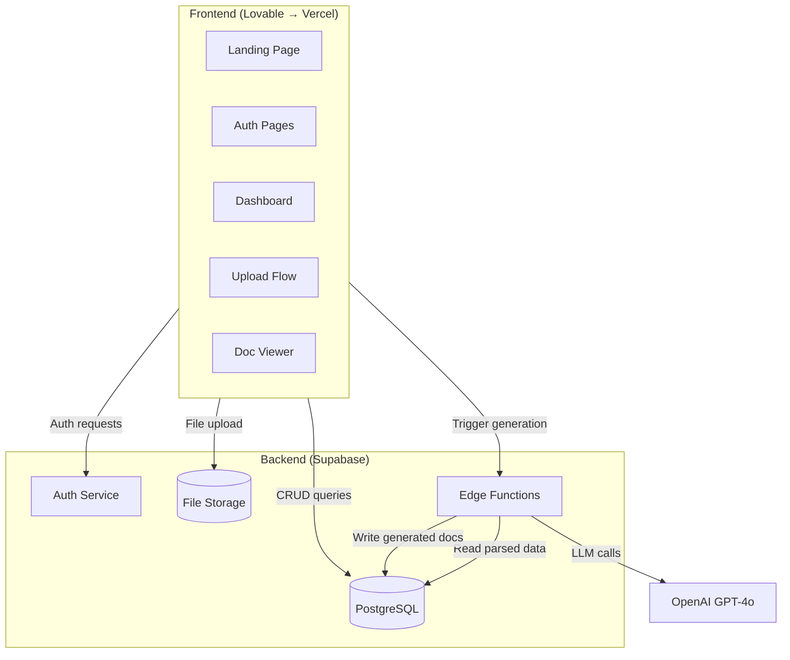
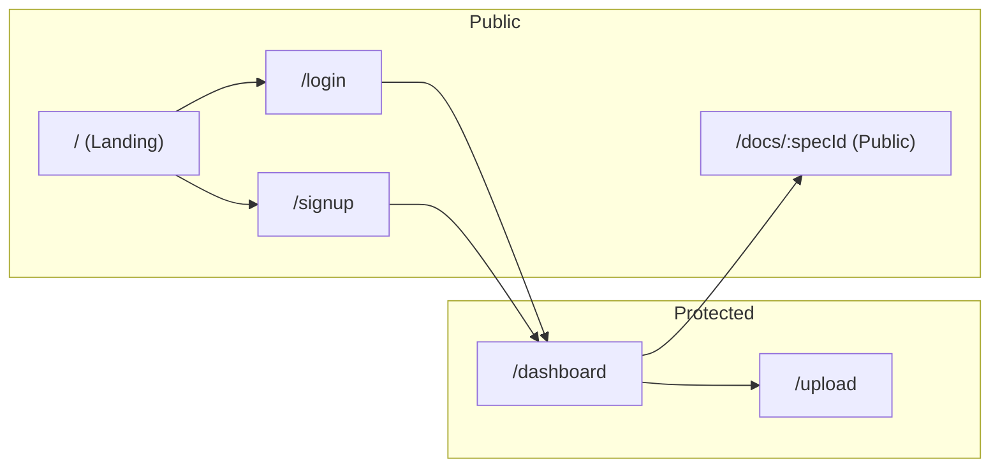
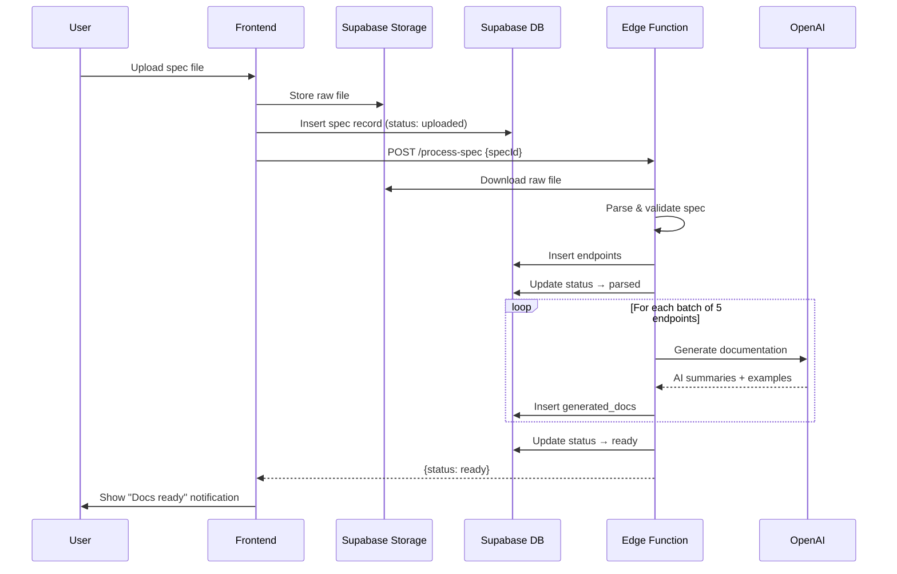
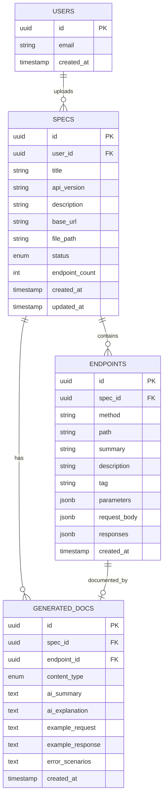
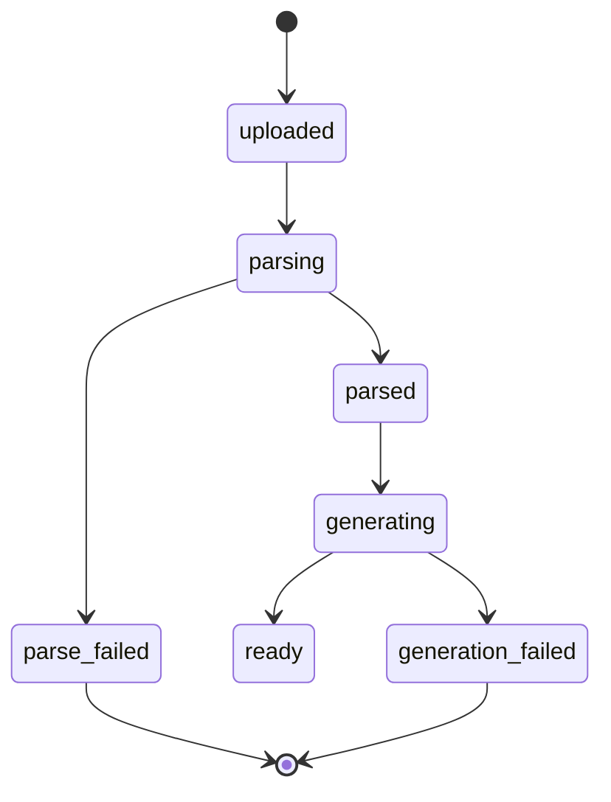
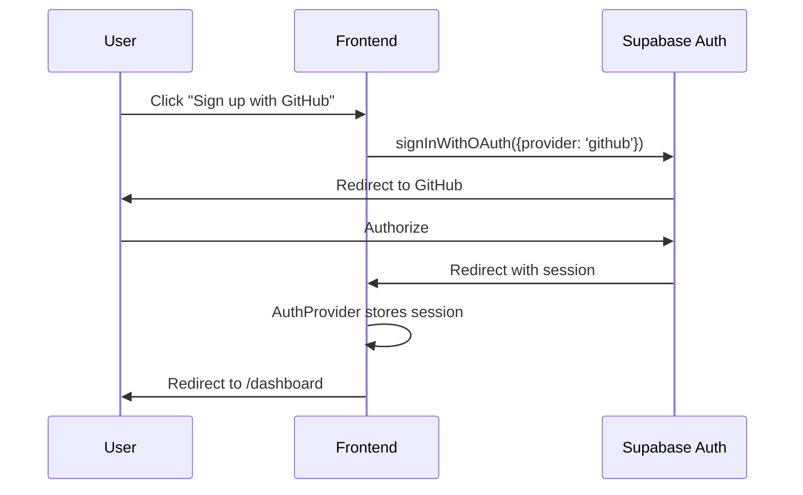
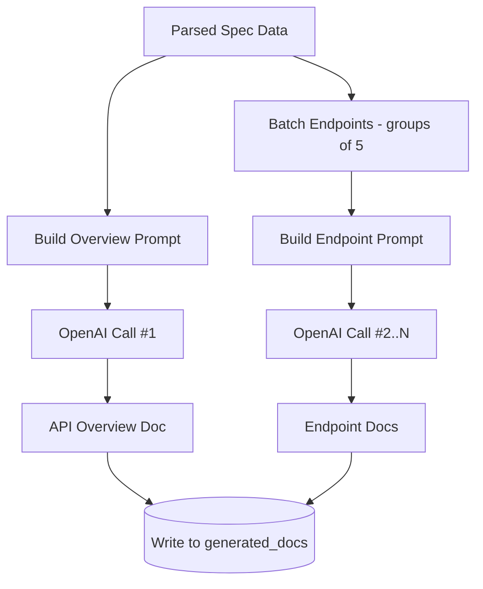
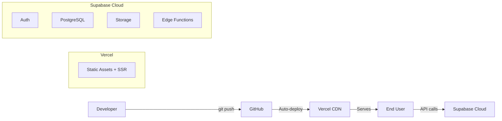
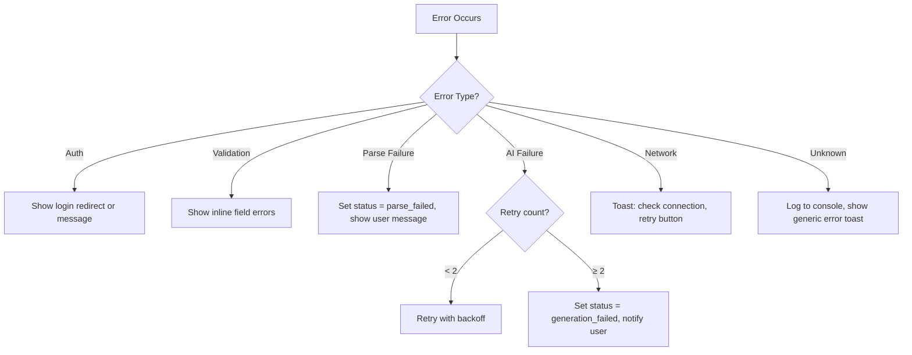

# APIPilot AI — Software Architecture

| Field | Value |
|---|---|
| **Document** | Architecture |
| **Version** | v0.1.0 (MVP) |
| **Author** | Vansh Singla |
| **Parent Docs** | [PROJECT_OVERVIEW.md](./PROJECT_OVERVIEW.md) · [PRD.md](./PRD.md) |
| **Last Updated** | July 2026 |

---

## 1. Overall Architecture

APIPilot AI follows a **client-heavy, serverless backend** pattern. The React frontend handles routing, UI state, and direct Supabase calls. Heavy lifting (AI generation) runs in Supabase Edge Functions.



**Why this pattern:**
- **No custom server.** Supabase provides auth, database, storage, and serverless functions. Zero DevOps.
- **Edge Functions for AI only.** The only logic that can't run client-side is the OpenAI integration (API key must stay server-side).
- **Direct Supabase calls from client.** Supabase JS SDK + Row-Level Security means the frontend can safely read/write data without a middleware layer.

---

## 2. Frontend Architecture

### Tech stack
- **Lovable** generates React + TypeScript + Tailwind CSS
- **React Router** for client-side routing
- **Supabase JS SDK** for auth, DB queries, and storage
- **Tanstack Query (React Query)** for server-state management and caching

### Page structure



### Component hierarchy

```
App
├── Layout (header, nav, footer)
│   ├── PublicRoute wrapper
│   │   ├── LandingPage
│   │   ├── LoginPage
│   │   ├── SignupPage
│   │   └── DocViewPage (public, no auth required)
│   └── ProtectedRoute wrapper (redirects to /login if unauthenticated)
│       ├── DashboardPage
│       │   ├── SpecCard (repeated)
│       │   ├── EmptyState
│       │   └── DeleteConfirmModal
│       └── UploadPage
│           ├── FileDropzone
│           ├── UploadProgress
│           └── ValidationErrors
├── DocViewPage
│   ├── ApiOverviewSection
│   ├── SearchBar
│   ├── SidebarNav
│   └── EndpointGroup (per tag)
│       └── EndpointCard (repeated)
│           ├── MethodBadge
│           ├── AiSummary
│           ├── ParamsTable
│           └── CodeBlock (request/response)
└── Providers
    ├── AuthProvider (Supabase session context)
    ├── QueryClientProvider (Tanstack Query)
    └── ThemeProvider
```

### State management

| State type | Tool | Example |
|---|---|---|
| Auth / session | Supabase `onAuthStateChange` + React Context | Current user, JWT |
| Server data | Tanstack Query | Specs list, generated docs |
| UI / local | React `useState` | Modal open/close, search input |
| Form | React Hook Form (or controlled inputs) | Upload form, auth forms |

No Redux, no Zustand. The app is small enough that Context + React Query covers everything.

---

## 3. Backend Architecture

The "backend" is entirely Supabase services. No Express, no Next.js API routes, no custom server.

### Services used

| Service | Purpose |
|---|---|
| **Supabase Auth** | User registration, login, OAuth, session management |
| **Supabase Database** | PostgreSQL for all structured data |
| **Supabase Storage** | Raw spec file storage (JSON/YAML) |
| **Supabase Edge Functions** | Serverless Deno functions for AI pipeline |

### Edge Functions

Two Edge Functions handle server-side logic:

**1. `process-spec`** — Triggered after file upload
- Reads raw file from Storage
- Parses and validates OpenAPI structure
- Extracts endpoints, params, schemas
- Writes parsed data to `endpoints` table
- Calls `generate-docs` or returns parse error

**2. `generate-docs`** — AI documentation generation
- Reads parsed endpoints from DB
- Batches endpoints (5 per LLM call)
- Sends structured prompts to OpenAI
- Writes AI output to `generated_docs` table
- Updates spec status to `ready` or `generation_failed`



---

## 4. Database Schema

### Entity-Relationship Diagram



### Table details

**`specs`**

| Column | Type | Notes |
|---|---|---|
| id | uuid (PK) | Default `gen_random_uuid()` |
| user_id | uuid (FK → auth.users) | RLS: users see only their own |
| title | text | Extracted from spec `info.title` |
| api_version | text | From spec `info.version` |
| description | text | From spec `info.description` |
| base_url | text | First server URL or basePath |
| file_path | text | Path in Supabase Storage |
| status | text | One of: `uploaded`, `parsing`, `parsed`, `generating`, `ready`, `parse_failed`, `generation_failed` |
| endpoint_count | integer | Count of paths × methods |
| created_at | timestamptz | Default `now()` |
| updated_at | timestamptz | Updated on status change |

**Status state machine:**



**`endpoints`**

| Column | Type | Notes |
|---|---|---|
| id | uuid (PK) | |
| spec_id | uuid (FK → specs) | Cascade delete |
| method | text | GET, POST, PUT, PATCH, DELETE |
| path | text | e.g., `/users/{id}` |
| summary | text | From spec, nullable |
| description | text | From spec, nullable |
| tag | text | First tag, or "default" |
| parameters | jsonb | Array of param objects |
| request_body | jsonb | Schema + content type |
| responses | jsonb | Status code → schema map |

**`generated_docs`**

| Column | Type | Notes |
|---|---|---|
| id | uuid (PK) | |
| spec_id | uuid (FK → specs) | Cascade delete |
| endpoint_id | uuid (FK → endpoints, nullable) | Null = API-level overview doc |
| content_type | text | `overview` or `endpoint` |
| ai_summary | text | 2–3 sentence summary |
| ai_explanation | text | Detailed explanation |
| example_request | text | cURL + JSON body |
| example_response | text | JSON response |
| error_scenarios | text | Common errors |

---

## 5. Authentication Architecture



### Auth rules

| Rule | Implementation |
|---|---|
| Session persistence | Supabase handles JWT refresh automatically |
| Protected routes | `ProtectedRoute` component checks `session`; redirects to `/login` if null |
| Public doc pages | `/docs/:specId` has no auth gate — anyone with the link can view |
| RLS on all tables | Every table has `WHERE user_id = auth.uid()` policy for SELECT, UPDATE, DELETE |
| Spec viewing exception | `generated_docs` and `endpoints` allow public SELECT when accessed via a valid `spec_id` |

---

## 6. Storage Architecture

Supabase Storage is used for one purpose: storing uploaded raw spec files.

| Bucket | Name | Access |
|---|---|---|
| Spec files | `specs` | Private. Accessible only via Edge Functions (service role key) |

### File path convention
```
specs/{user_id}/{spec_id}/original.{json|yaml}
```

### Storage policies
- **Upload:** Authenticated users can upload to their own `user_id` prefix
- **Download:** Only Edge Functions (service role) read files for parsing
- **Delete:** Cascade — when spec record is deleted, trigger removes the file

---

## 7. AI Prompt Pipeline

This is the core differentiator. The prompt design determines output quality.

### Pipeline overview



### Prompt structure

**Overview prompt** (1 call per spec):

```
System: You are a senior API technical writer. Given API metadata,
write a concise overview for developers who are seeing this API
for the first time. Be factual — only use information provided.

User:
- API Title: {title}
- Version: {version}
- Description: {description}
- Base URL: {base_url}
- Auth: {security_schemes}
- Endpoint count: {count}
- Tags: {tag_list}

Generate:
1. Overview (3-4 sentences)
2. Authentication guide
3. Getting started (which endpoints to call first)

Respond in JSON: {overview, auth_guide, getting_started}
```

**Endpoint prompt** (1 call per batch of 5):

```
System: You are a senior API technical writer. For each endpoint,
generate developer documentation. Be precise — only reference
data from the provided spec. Do not invent fields or parameters.

User:
[Array of endpoint objects with method, path, summary,
 parameters, request_body, responses]

For each endpoint generate:
1. Summary (2-3 sentences)
2. Parameter explanations
3. Example cURL request
4. Example JSON response
5. Common error scenarios

Respond as JSON array matching input order.
```

### Prompt design principles

| Principle | Why |
|---|---|
| **Structured JSON output** | Predictable parsing; no regex extraction needed |
| **Strict grounding** | "Only use information provided" prevents hallucination |
| **Batching (5 per call)** | Balances context window usage vs. number of API calls |
| **System + User separation** | System sets persona and rules; User provides data |
| **No chat history** | Each call is stateless — simpler, cheaper, more reliable |

### Cost estimate

| Spec size | API calls | Estimated cost |
|---|---|---|
| 10 endpoints | 1 overview + 2 batch | ~$0.01 |
| 50 endpoints | 1 overview + 10 batch | ~$0.05 |
| 100 endpoints | 1 overview + 20 batch | ~$0.10 |

---

## 8. Deployment Architecture



### Environments

| Environment | URL | Branch | Purpose |
|---|---|---|---|
| Production | `apipilot.vercel.app` | `main` | Live product |
| Preview | `*.vercel.app` | PR branches | Review before merge |
| Local | `localhost:5173` | Any | Development |

### Environment variables

| Variable | Where | Purpose |
|---|---|---|
| `VITE_SUPABASE_URL` | Vercel + local | Supabase project URL |
| `VITE_SUPABASE_ANON_KEY` | Vercel + local | Public client key (safe to expose) |
| `SUPABASE_SERVICE_ROLE_KEY` | Edge Functions only | Full DB access for server-side ops |
| `OPENAI_API_KEY` | Edge Functions only | LLM API access — never on client |

---

## 9. Folder Structure

```
apipilot-ai/
├── docs/                          # Project documentation
│   ├── PROJECT_OVERVIEW.md
│   ├── PRD.md
│   ├── ARCHITECTURE.md            # This file
│   ├── DATABASE.md
│   ├── API_FLOW.md
│   ├── DECISIONS.md
│   ├── ROADMAP.md
│   ├── UI_UX.md
│   ├── CHANGELOG.md
│   └── LEARNINGS.md
│
├── src/
│   ├── components/                # Reusable UI components
│   │   ├── ui/                    # Base components (Button, Card, Modal, Badge)
│   │   ├── layout/                # Header, Footer, Sidebar, ProtectedRoute
│   │   ├── auth/                  # LoginForm, SignupForm
│   │   ├── dashboard/             # SpecCard, EmptyState, DeleteModal
│   │   ├── upload/                # FileDropzone, UploadProgress, ValidationErrors
│   │   └── docs/                  # ApiOverview, EndpointCard, SearchBar, MethodBadge, CodeBlock
│   │
│   ├── pages/                     # Route-level page components
│   │   ├── LandingPage.tsx
│   │   ├── LoginPage.tsx
│   │   ├── SignupPage.tsx
│   │   ├── DashboardPage.tsx
│   │   ├── UploadPage.tsx
│   │   └── DocViewPage.tsx
│   │
│   ├── lib/                       # Utilities and configuration
│   │   ├── supabase.ts            # Supabase client init
│   │   ├── constants.ts           # App-wide constants
│   │   └── utils.ts               # Helpers (formatDate, truncate, etc.)
│   │
│   ├── hooks/                     # Custom React hooks
│   │   ├── useAuth.ts             # Auth state + methods
│   │   ├── useSpecs.ts            # CRUD operations on specs
│   │   └── useGeneratedDocs.ts    # Fetch generated docs for a spec
│   │
│   ├── services/                  # API interaction layer
│   │   ├── specService.ts         # Upload, parse, delete specs
│   │   └── docsService.ts         # Fetch generated documentation
│   │
│   ├── types/                     # TypeScript type definitions
│   │   ├── spec.ts                # Spec, Endpoint, GeneratedDoc types
│   │   └── auth.ts                # User, Session types
│   │
│   ├── providers/                 # React context providers
│   │   └── AuthProvider.tsx
│   │
│   ├── App.tsx                    # Root component + router
│   ├── main.tsx                   # Entry point
│   └── index.css                  # Global styles + Tailwind config
│
├── supabase/
│   ├── migrations/                # SQL migration files
│   │   ├── 001_create_specs.sql
│   │   ├── 002_create_endpoints.sql
│   │   ├── 003_create_generated_docs.sql
│   │   └── 004_rls_policies.sql
│   │
│   └── functions/                 # Edge Functions
│       ├── process-spec/
│       │   └── index.ts
│       └── generate-docs/
│           └── index.ts
│
├── public/                        # Static assets
├── .env.local                     # Local env vars (gitignored)
├── .gitignore
├── package.json
├── tsconfig.json
├── vite.config.ts
└── README.md
```

### Naming conventions

| Item | Convention | Example |
|---|---|---|
| Components | PascalCase | `SpecCard.tsx` |
| Hooks | camelCase, `use` prefix | `useSpecs.ts` |
| Services | camelCase, `Service` suffix | `specService.ts` |
| Types | PascalCase | `Spec`, `Endpoint` |
| DB tables | snake_case, plural | `generated_docs` |
| Edge Functions | kebab-case | `process-spec` |
| CSS classes | Tailwind utilities | — |

---

## 10. Security Architecture

### Threat model (MVP scope)

| Threat | Mitigation |
|---|---|
| **Unauthorized data access** | RLS policies on every table: `user_id = auth.uid()` |
| **API key exposure** | OpenAI key only in Edge Function env vars, never in client bundle |
| **Malicious file upload** | Client-side type + size validation, server-side OpenAPI structure validation |
| **XSS via spec content** | AI output rendered as text, not raw HTML. React's default escaping applies. |
| **CSRF** | Supabase uses bearer tokens, not cookies — CSRF not applicable |
| **Excessive AI usage** | Rate limit: 5 specs/day per user (checked in Edge Function) |

### RLS policy summary

```
-- specs: users see only their own
SELECT: auth.uid() = user_id
INSERT: auth.uid() = user_id
UPDATE: auth.uid() = user_id
DELETE: auth.uid() = user_id

-- endpoints: public read (for shareable docs), write via service role only
SELECT: true (public — needed for /docs/:specId)
INSERT/UPDATE/DELETE: service_role only

-- generated_docs: same as endpoints
SELECT: true
INSERT/UPDATE/DELETE: service_role only
```

---

## 11. Error Handling Strategy

### Error categories



### User-facing error messages

| Scenario | Message |
|---|---|
| Invalid file type | "Please upload a .json or .yaml file." |
| File too large | "File size must be under 5 MB." |
| Invalid spec structure | "This doesn't appear to be a valid OpenAPI spec. Check that it contains an `openapi` or `swagger` field." |
| AI generation failed | "Documentation generation failed. Please try again." |
| Network error | "Connection lost. Please check your internet and try again." |
| Unauthorized | Redirect to `/login` silently |

### Logging

| Layer | What's logged | Where |
|---|---|---|
| Frontend | Auth errors, failed API calls | Browser console (dev), Vercel logs (prod) |
| Edge Functions | Parse errors, AI call failures, timing metrics | Supabase Function logs |
| Database | RLS violations | Supabase dashboard |

---

## 12. Future Scalability

### v0.2.0 preparations (Chat with API)

| Current decision | Why it helps later |
|---|---|
| Endpoint data stored as structured JSONB | Easy to convert to vector embeddings for RAG |
| Edge Functions are isolated | Add a `chat` function without touching existing ones |
| Spec-scoped data model | Chat context is naturally scoped to a single spec |

### v0.3.0 preparations (Teams)

| Current decision | Why it helps later |
|---|---|
| `user_id` on specs | Add a `workspace_id` column later; update RLS policies |
| Auth via Supabase | Supabase supports org-level auth and team invitations |
| Component-based frontend | Dashboard components can be reused in team views |

### Scaling considerations if usage grows

| Bottleneck | Solution |
|---|---|
| OpenAI rate limits | Add queue (Supabase Realtime or external) with worker pattern |
| Large spec files | Stream parsing instead of loading entire file into memory |
| Database size | Add indexes on `spec_id`, `user_id`, `status`; partition `generated_docs` by `spec_id` |
| Concurrent Edge Function invocations | Supabase scales automatically; upgrade plan if needed |
| Storage costs | Add TTL policy — auto-delete specs not accessed in 90 days (post-MVP) |

---

*This architecture document is the technical blueprint for APIPilot AI v0.1.0. All implementation decisions should reference this doc. Update it when architectural choices change.*
